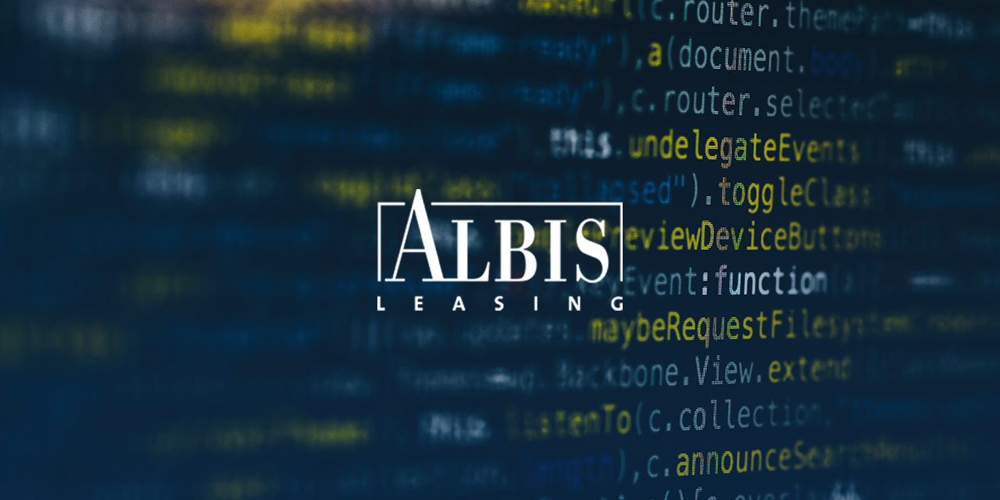
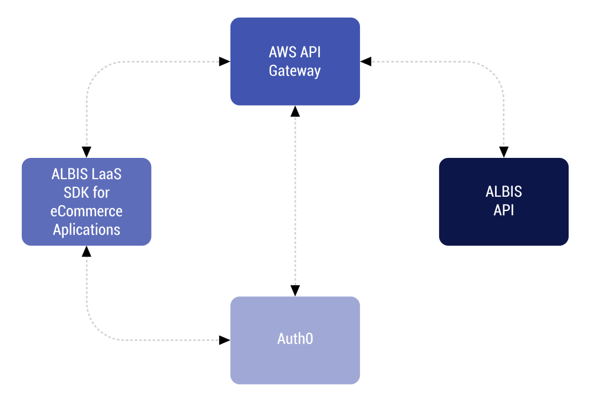

# ALBIS Leasing SDK

## Übersicht
Mit dem „ALBIS Leasing SDK“ können B2B-Shopbetreiber Leasing einfach und flexibel als neue Zahlungsart anbieten. Die neue Zahlungsart kann einfach und schnell über das SDK in Shop-Systeme integriert werden.

Das ganze System ist dafür designt worden, um Integrationen in unterschiedlichste Shop-Umgebungen so einfach und schnell wie möglich zu gestalten und babei ein Maximum an Sicherheit zu bieten.

## Technische Details

### Aufbau des Systems

Der ALBIS Leasing (LaaS) Leasing-as-a-service) Dienst läuft in der sicheren und hochverfügbaren AWS-Cloud. Dies gewährleistet den schnellen, ausfallsicheren und hochverfügbaren Service für ALBIS Shop-Partner.

Der Entwickler greift auf diesen Dienst bequem über das ALBIS LaaS SDK zu und kann Leasing als Zahlungsmethode einfach in sein Shop-System integrieren.

Zum Begutachten der Funktionen steht ein Beispiel-Shop über Netlify bereit, über den Interessenten das System ausprobieren können. Außerdem steht zum Entwickeln und Testen des SDK eine eigene Instanz der API bereit.

### SDK-Sprachenunterstützung
Ab sofort ist das ALBIS LaaS SDK in JavaScript verfügbar. Weitere Sprachen wie zum Beispiel PHP oder Java folgen in Kürze.

### Dokumentation und Anwendungs-Beispiele
Hier über GitHub finden Enwickler alle notwendigen und hilfreichen Informationen zur Integration der SDK: 

- Dokumentation
- Bibliotheken für gängige Programmiersprachen
- Code-Beispiele inklusive Beispiel-Shop-Integration
